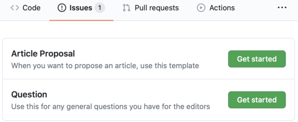

<!--
WARNING: Don't edit this file on individual author repos.
Honeybadger staff periodically pushes out new versions of this
file to all author repos. Any changes you make will be
overwritten when we do this.
-->

<!-- omit in toc -->
# Hello, dear Author. Welcome to your repo! ✨✨✨

This README is the first place you should look if you have questions about working with us. It will always have the latest info about:

- [How to get in touch](#how-to-get-in-touch)
- [What to do if you're a new author](#what-to-do-if-youre-a-new-author)
- [A step-by-step guide to our writing process](#a-step-by-step-guide-to-our-writing-process)
- [The directory structure](#the-directory-structure)

For additional information, check out the following item(s) in the `docs/` folder:

- [Markdown Style Guide](docs/style-guide/style-guide.md)

## How to get in touch

We use GitHub issues for most communication. To get in touch, simply create a new issue using the appropriate template:

- **Question** - Use this template for any general questions or comments you have.
- **Article Proposal** - Only use this template after you have read our [step-by-step guide to the writing process](#a-step-by-step-guide-to-our-writing-process) and are submitting an article proposal.

The UI will look something like this:



## What to do if you're a new author

If you're new, please do the following things:

- Fill in `author.yml`. This is where we keep all the info about you that we need to publish your articles and get you paid.
- Replace `headshot.jpg` with your own headshot. It should be high resolution and clearly show your shoulders and head. You should be facing the camera.
- Check out the example article in `articles/style-guide`. In addition to being an example article, it's also our markdown style guide.

Now you're ready to get started on your first article. Take a look at our step-by-step guide and start with step 1. 😉

## A step-by-step guide to our writing process

Every article we commission follows the same process of ideation, proposal, writing and editing.

The guide below tells you exactly what you need to do for each step along the way.

1. ### Ask about the topic

   Before developing an idea, please ask us for feedback on the topic. This will save you a lot of time if the topic doesn't work for us, or we already have it covered.

   1. Create a new issue and select the "Question" template
   2. Say something like: "Hey, I'm thinking about proposing an article on marshmallows. Would you be interested in that?"
   3. Save the issue, but don't touch assignments or labels.

   We will get back to you asap.

2. ### Propose an article

   Once you've run the topic by us, you can propose an article

   1. Create an issue on this repo using the "Article Proposal" template.
   2. The issue body will contain a list of questions. Answer them all to the best of your ability.
   3. Save the issue, but don't touch assignments or labels.

   This GitHub Issue is where all future communication concerning this article will take place.

   We will review your proposal at our weekly content meeting and get back to you.

3. ### Writing the first draft

   When we've approved your proposal, you'll write the first draft. There are no deadlines.

   Please:

   - Do all work on the master branch
   - Follow our [Markdown Style Guide](docs/style-guide/style-guide.md)
   - Put your files in the place we tell you to

4. ### Submitting the draft for review

   When you are ready for feedback:

   1. Make sure all your work is pushed to master
   2. Pull up the GitHub Issue containing your article proposal.
   3. Leave a comment saying you want a review. That's it. :)

   Please don't open any PRs. It usually takes a week or so to get your review.

5. ### Writing the second draft
   This is where you incorporate any suggestions from your review. Please push to the master branch.
6. ### Submitting the 2nd draft for editing
   When you're ready, simply leave another comment on the issue. It typically takes a week or two to do edits.
7. ### Approving edits

   When edits are ready, we push them to a branch, open a PR, and request your review.

   If you don't like any of our edits, please:

   1. Make your changes and push to the PR branch
   2. Leave a comment on the PR explaining your changes.

   Once you are happy with the edits, please merge and close the PR.

8. ### Payment
   We typically pay authors within 1-2 weeks of edits being approved
9. ### Publication
   We typically publish 2-3 months after an article is completed.

## The directory structure

We use a standard directory structure. Please stick to it. Otherwise, our internal build tools won't work.

```
author.yml            # Your byline information. Please edit.
headshot.jpg          # Your headshot. Please upload.

/articles
  /my-article-name    # Each article has a subdirectory
    article.md        # Your article text is always named article.md
    some-image.png    # Your images go here and can have any name
    _datasheet.yml    # Used by Honeybadger Staff. Please don't edit.

  /another-article-name
    article.md
    another-image.jpg

/docs
  style-guide/        # Our markdown styleguide. Please read.

/.github              # Don't touch this
```
