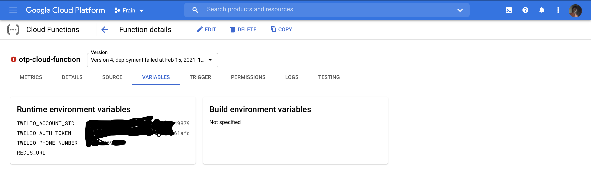
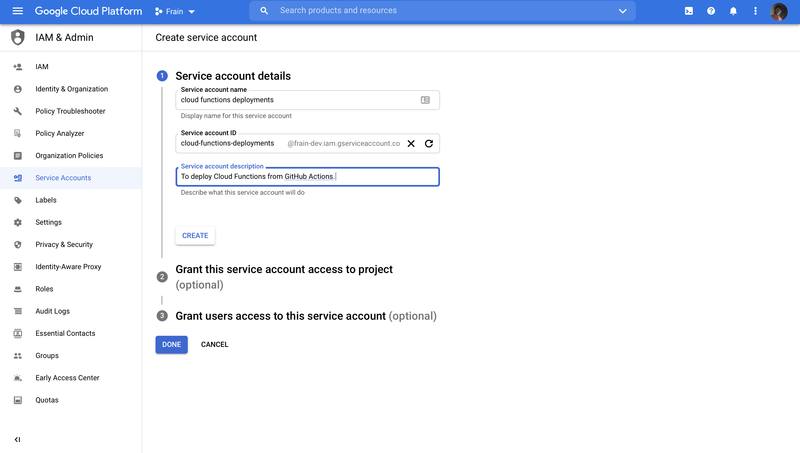
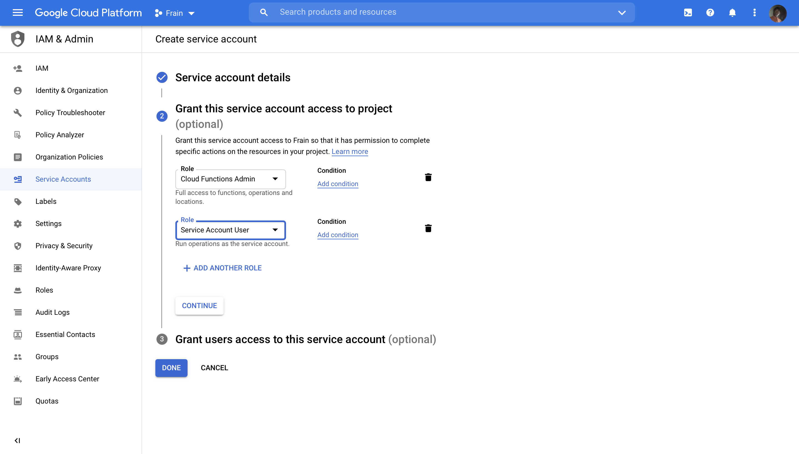
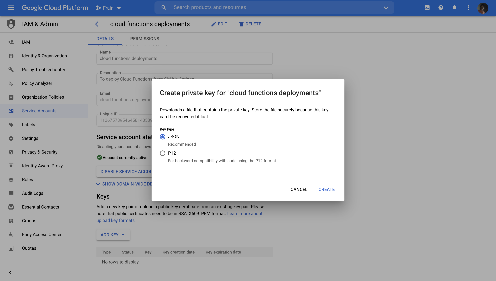
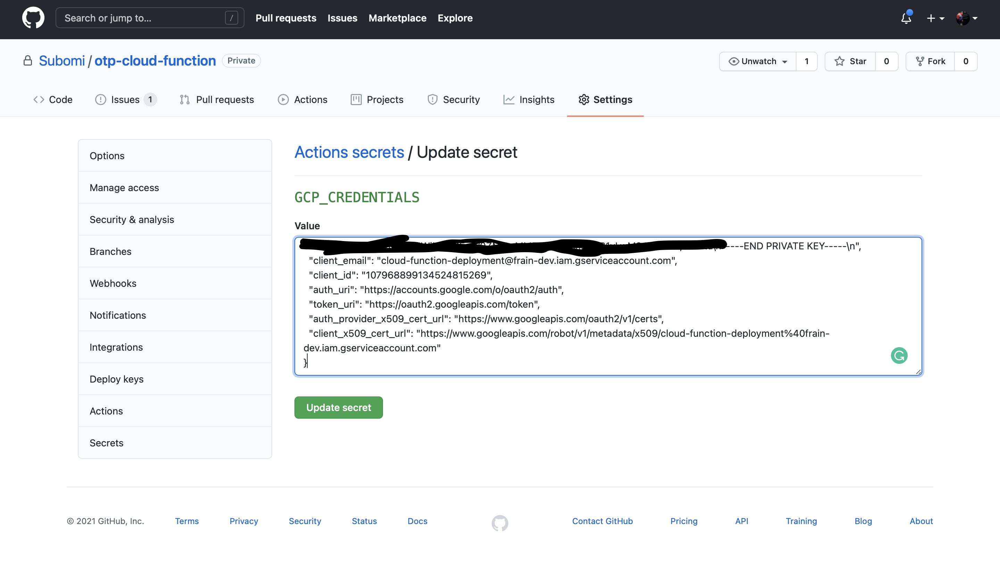
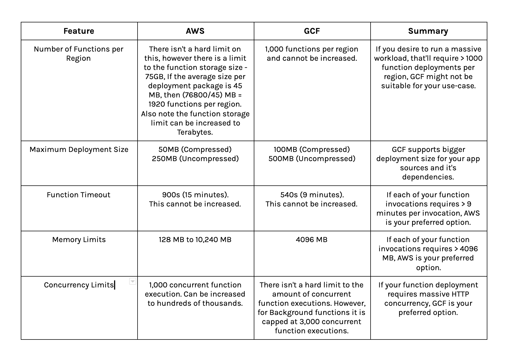

# Building, Testing and Deploying Google Cloud Functions with Ruby

### What are Serverless Functions?

Serverless Functions are a new programming paradigm of developing and deploying cloud services. In a serverless world, we abstract the provisioning, maintenance and scaling of our backend services to the cloud provider. This substantially improves developer productivity by allowing developers focus clearly on solving their specific problem. While there are many advantages and disadvantages of building serverless functions, one of things to consider in building them is langauge support. Recently, Google announced the support of Ruby 2.7 for Google Cloud Functions, and in this article, I'll be focusing on building, testing & deploying a serverless function in Ruby on Google Cloud Functions vs. the pros & cons of serverless functions.

### Building a Serverless OTP System

OTP stands for "one time password." They're the little numeric codes that your bank might text you to verify your identity. 

In this article, I'll be building an OTP Function that handles 3 core responsibilities: 

- `POST /otp`: Generates and sends an OTP message to the provided `phone_number`.

    ```
    # Request
    {
    	"phone_number": "+2347012345678"
    }

    # Response
    {
      "status": true,
      "message": "OTP sent successfully",
      "data": {
        "phone_number": "+2347012345678",
        "otp": 6872,
        "expires_at": "2021-02-09 07:15:25 +0100"
      }
    }
    ```

- `PUT /otp/verify`: Verifies an OTP against user provided OTP.

    ```
    # Request
    {
    	"phone_number": "+2347012345678",
    	"otp": 7116
    }

    # Response
    {
      "status": true,
      "message": "OTP verified",
      "data": {}
    }
    ```

- `PUT /otp/resend`: Tries to generate and resend an OTP to the provided `phone_number`.

    ```
    # Request
    {
    	"phone_number": "+2347012345678"
    }

    # Response
    {
      "status": true,
      "message": "OTP sent successfully",
      "data": {
        "phone_number": "+2347012345678",
        "otp": 8533,
        "expires_at": "2021-02-09 08:59:16 +0100"
      }
    }
    ```

For the sake of simplicity, our Cloud Function will be backed by a Cloud MemoryStore (Redis or Memcache on GCP) rather than a full SQL or NoSQL Database. This also, we enable us learn about shared state in a stateless environment like this.

### Writing a Google Cloud Function with Ruby

To write functions in GCF, we'd rely on the `Functions Framework` provided by the Google Cloud team for building GCF functions (more on this later.).

1. Create App directory and enter the directory

    ```bash
    mkdir otp-cloud-function && cd otp-cloud-function
    ```

2. Create your Gemfile and Install

    Like most standard ruby applications we'll be using `bundler` to manage our function's dependencies

    ```ruby
    source "https://rubygems.org"

    # Core 
    gem "functions_framework", "~> 0.7"

    # Twilio for Sms
    gem 'twilio-ruby', '~> 5.43.0'

    # Database
    gem 'redis'

    # Connection Pooling
    gem 'connection_pool'

    # Time management
    gem 'activesupport'

    # API Serialization
    gem 'active_model_serializers', '~> 0.10.0'

    group :development, :test do
      gem 'pry'
      gem 'rspec'
      gem 'rspec_junit_formatter'
      gem 'faker', '~> 2.11.0'
    end
    ```

    ```bash
    bundle install
    ```

3. Create your functions source file - `app.rb`

    Generally, different hosting environments allow you specify a different file where your functions are written. Google Cloud Functions, however, requires it to be `app.rb` in the root of your project directory. Now, we're ready to write our function. 

    ```bash
    touch app.rb
    ```

4. Write OTP function

    ```ruby
    # Cloud Functions Entrypoint

    require 'functions_framework'
    require 'connection_pool'
    require 'active_model_serializers'
    require './lib/store'
    require './lib/send_sms_notification'
    require './lib/response'
    require './lib/serializers/models/base_model'
    require './lib/serializers/models/otp_response'
    require './lib/serializers/application_serializer'
    require './lib/serializers/base_model_serializer'
    require './lib/serializers/otp_response_serializer'

    FunctionsFramework.on_startup do |function|
      # Setup Shared Redis Client
      require 'redis'
      set_global :redis_client, ConnectionPool.new(size: 5, timeout: 5) { Redis.new }
    end

    # Define HTTP Function
    FunctionsFramework.http "otp" do |request|

      store = Store.new(global(:redis_client))
      data = JSON.parse(request.body.read)

      if  request.post? && request.path == '/otp'
        phone_number = data['phone_number']
        record = store.get(phone_number)
        unless record.nil? || record.expired?
          data = Models::OtpResponse.new(phone_number: phone_number,
                                         otp: record['otp'],
                                         expires_at: record['expires_at'])
          json = Response.generate_json(status: true, 
                               message: 'OTP previously sent',
                               data: data)

          return json
        end

        otp = rand(1111..9999)
        record = store.set(phone_number, otp)
        SendSmsNotification.new(phone_number, otp).call

        data = Models::OtpResponse.new(phone_number: phone_number,
                                       otp: record['otp'],
                                       expires_at: record['expires_at'])

        Response.generate_json(status: true, 
                             message: 'OTP sent successfully',
                             data: data)

      elsif request.put? && request.path == '/otp/verify'
        phone_number = data['phone_number']
        record = store.get(phone_number)
        
        if record.nil?
          return Response.generate_json(status: false, message: "OTP not sent to number")
        elsif record.expired?
          return Response.generate_json(status: false,  message: 'OTP code expired')
        end

        is_verified = data['otp'] == record['otp']

        if is_verified
          return Response.generate_json(status: true, message: 'OTP verified')
        else
          return Response.generate_json(status: false, message: 'OTP does not match')
        end

      elsif request.put? && request.path == '/otp/resend'
        phone_number = data['phone_number']
        store.del(phone_number)

        otp = rand(1111..9999)
        record = store.set(phone_number, otp)
        SendSmsNotification.new(phone_number, otp).call

        data = Models::OtpResponse.new(phone_number: phone_number,
                                       otp: record['otp'],
                                       expires_at: record['expires_at'])

        json = Response.generate_json(status: true, 
                             message: 'OTP sent successfully',
                             data: data)
      else
        Response.generate_json(status: false,
                               message: 'Request method and path did not match')
      end
    end
    ```

    While the above is a lot, let's try to break it down 

    - `Functions_Framework.on_startup`: is a block of code that runs per Ruby instance before functions begin processing requests. This is ideal to run any form of initialisation before our functions are called. In this case, I'm using it to create and share a connection pool to our Redis server -

        ```ruby
        set_global :redis_client, ConnectionPool.new(size: 5, timeout: 5) { Redis.new }
        ```

        This enables us share a pool of Redis connection objects across multiple concurrent function invocations without fear. Multiple startups can be defined. They'll be run in order as they are defined. It is important also to note that the `Functions Framework` does not provide any special hook to run after function completion.

    - `Functions_Framework.http 'otp' do |request|`:  Handles the request and response processing of our functions. This function supports 3 different route patterns. It is possible to define other types of functions e.g. `Functions_Framework.cloud_event 'otp' do |event|` that handles events from other Google services. It is possible as well, to define multiple functions in the same file, but deployed independently.
    - `store = Store.new(global(:redis_client))`: The  `global` method is used to retrieve any object stored in the global shared state.  As it is used above, we retrieve the Redis client from the Connection pool defined in the global setup in our `startup` block.
    - `Response` and `Models::OtpResponse`: This components handles response serialisation with `active_model_serializers` to give properly formatted JSON responses.

### Testing our Function Locally

The `Functions Framework` library enables us to locally test our functions with ease before deploying them to the cloud. To test locally, we run

```bash
bundle exec functions-framework-ruby --target=otp --port=3000
```

`--target` is used to select the function to deploy.

- Automated Tests for our GCF Function

    While manual testing is great. Automated tests and self testing software is our holy grail in testing, the `Functions Framework` provides helper methods for both `Minitest` and `RSpec` to help us test our functions both for the `http` and `cloudevents` handlers. An example of a test is below:

    ```ruby
    require './spec/spec_helper.rb'
    require 'functions_framework/testing'

    describe  'OTP Functions' do 
      include FunctionsFramework::Testing

      describe 'Send OTP', redis: true do
        let(:phone_number) { "+2347012345678" }
        let(:body) { { phone_number: phone_number }.to_json }
        let(:headers) { ["Content-Type: application/json"] }

        it 'should send OTP successfully' do
          load_temporary "app.rb" do
            request = make_post_request "/otp", body, headers

            response = call_http "otp", request
            expect(response.status).to eq 200 
            expect(response.content_type).to eq("application/json")

            parsed_response = JSON.parse(response.body.join)
            expect(parsed_response['status']).to eq true
            expect(parsed_response['message']).to eq 'OTP sent successfully'
          end
        end
      end
    end
    ```

### Deploying our Function

First, we need to deploy a Redis server using `Google Cloud Memorystore`, which our function is dependent on. I won't go into further details on how to deploy a Redis server to the GCP as that is outside the scope of this article. 

There are multiple ways of deploying our function to the Google Cloud Function's environment - Deploying from your machine, deploying from the GCP Console, deploying from our Code Repositories. Modern software engineering encourages CI/CD processes for most of our development and for the purpose of this article I'll be focusing on deploying our Cloud Function from Github with Github Actions using [deploy-cloud-functions](https://github.com/google-github-actions/deploy-cloud-functions). 

1. Let's setup our Deployment File (.github/workflows/deploy.yml)

    ```json
    name: Deployment
    on:
      push:
        branches:
          - main
    jobs:
      deploy:
        name: Function Deployment
        runs-on: ubuntu-latest
        steps:
          - uses: actions/checkout@v2
          - id: deploy
            uses: google-github-actions/deploy-cloud-functions@main
            with:
              name: otp-cloud-function
              runtime: ruby26
              credentials: ${{ secrets.gcp_credentials }}
              env_vars: "TWILIO_ACCOUNT_SID=${{ secrets.TWILIO_ACCOUNT_SID }},TWILIO_AUTH_TOKEN=${{ secrets.TWILIO_AUTH_TOKEN }},TWILIO_PHONE_NUMBER=${{ secrets.TWILIO_PHONE_NUMBER }},REDIS_URL=${{ secrets.REDIS_URL }}"
    ```

2. Environment Variables: From the above code, the last line allows us specify environment variables that will be available to our function in the Google Cloud environment. Also note that for security reasons, we're not exposing this variables in our codebase rather, we're utilising Github actions secrets, to keep this information private. To check if our tokens have been properly deployed, check your cloud function in the Google Console, like below: 

    

3. Create a `Service Account` with a `Cloud Functions Admin` and `Service Account User` role.

    A service account is an account used for machine to machine IAM. This means when a system (running on the Google Cloud or not.) talks to another system on the Google Cloud, a service account is needed to help us identify who is requesting access to our Google resource. The roles `Cloud Functions Admin` and `Service Account User` enables to know if the user is authorised to access the resource. In this scenario, a Github Action runner is communicating with Google Cloud authenticating as a service account with the necessary permissions to deploy our function.

    

    

4. Create a Service Account Key, download JSON and add it to GitHub Secrets.

    

    

Voila 🎉 Our Cloud Function has been deployed successfully. 

### Cloud Functions Limits vs. AWS Limits

Below is a detailed comparison of two of the biggest Serverless function providers:



### Functions Framework Contract vs. Serverless Framework

In this article, we've focused clearly on building cloud functions for Google Cloud Functions. In this segment, I want to compare building with the Functions Framework vs. Serverless Framework.

- The `Serverless Framework` is based off the `serverless.yml` While Functions Framework is based off the `Functions Framework Contract` used to deploy serverless functions across Google Cloud Infrastructure.
- With the `Serverless Framework` there are only few examples and it isn't quite clear how to build & deploy serverless functions with Ruby to the different Google serverless environments (Cloud Functions, Cloud Run & Knative environments) with the `Functions Framework Contract` function it is straightforward to build with Ruby across these different Google products.
    - Following from the previous point, the `Functions Framework Contract` makes it very easy to switch the backing language behind your function without necessarily changing much in your deployment process.
- As of this writing, `Functions Framework` only supports interoperability across Google Cloud Serverless Environments & knative environments. `Serverless Framework` on the other hand supports multiple platforms, across multiple providers.

For reference, the full code is available [here](https://github.com/Subomi/otp-cloud-function)
