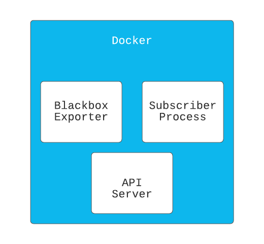

# How to use GCE, Cloud Storage and PubSub to build an uptime monitoring system in Ruby - II

In our previous article we built and deployed the `blackbox_exporter` service. At the end of that article, the service listens on a PubSub topic for bucket changes and automagically reloads the `blackbox_exporter`. 

In this article, we will be building on that foundation to make our service more reliable and flexible to configuration changes. With all configuration management, imagine we decide we want to be able to rollback bad configuration updates? how do we preserve old configuration files? how do we put safety in place so our Cloud Storage cost doesn't grow astronomically overnight? Are you ready? Let's have fun!

But first, the basics ...

### What is Object Versioning & Lifecycle Management?

Object versioning is a feature of Google Cloud Storage that enables us retain deleted & replaced objects in the bucket. Every object in Cloud Storage comes with a generation number with or without Object versioning enabled. The generation number is used to uniquely identify data resources in Cloud Storage. Lifecycle management on the other hand, is a set of rules, each rule contains a set of conditions to either delete an object or change its storage class when matched. When used together, we can provide versioning on configuration files as well as keep Cloud Storage costs to a minimum by ensuring that objects are either deleted based on a threshold or moved to a lower cost storage. 

In addition to what was built in the previous article, we will be build an API Server component, set versioning on for the bucket and turn on lifecycle management with one rule that deletes objects that have newer versions capped at 5 versions i.e. If an object has 5 newer objects delete the old ones.

### Baking in Object Versioning & Lifecycle management into our BlackBoxWrapper Service

From the previous article, we ran a docker container with 2 processes, in this version we spin up a new component - an API Server as show in the image here.



Let's proceed to write out our API Spec:

- `GET /versions?filename=blackbox.yml`: Provides a list of versions available for a particular object.

    ```bash
    # Request - Only query params.

    # Response
    {
      "status": true,
      "data": {
        "currentVersion": 1619184278185025,
        "versions": [
          1619175630028528,
          1619175879674384,
          1619176834822648,
          1619176913279443,
          1619184181099072,
          1619184278185025
        ]
      }
    }
    ```

- `POST /versions/rollback/:version?filename=blackbox.yml`: Rollback a particular object to a previous version.

    ```bash
    # Request - Only query params.

    # Response
    {
      "status": true,
      "data": {
        "currentVersion": 1619176913279443
      }
    }
    ```

### Extending the Blackbox Wrapper Code

1. Add Sinatra to Gemfiles and install.

    ```ruby
    gem 'sinatra'
    gem 'sinatra-contrib'
    ```

    ```bash
    bundle install
    ```

2. Create server code.

    ```bash
    touch server.rb
    ```

3. Write Server

    ```ruby
    require 'sinatra/base'
    require 'sinatra/required_params'
    require 'sinatra/json'
    require 'google/cloud/storage'

    CONFIG_BUCKET = ENV['BUCKET_NAME']

    class Server < Sinatra::Base
      helpers Sinatra::RequiredParams

      set :port, 8000

      get '/versions' do 

        required_params :filename
        filename = params[:filename]

        puts "Getting versions for #{filename}"
        storage = Google::Cloud::Storage.new
        bucket = storage.bucket CONFIG_BUCKET

        file = bucket.file filename
        current_version = file.generation
        generations = file.generations.map do |versioned_file|
          versioned_file.generation
        end

        data = { 
          status: true, 
          data: {
            currentVersion: current_version,
            versions: generations
          }
        }
          
        json(data)
      end

      post '/versions/rollback/:version' do
        required_params :version, :filename
        version = params[:version]
        filename = params[:filename]
        
        puts "Rolling back to #{version} version"
        storage = Google::Cloud::Storage.new
        bucket = storage.bucket CONFIG_BUCKET

        file = bucket.file filename
        new_file = file.copy bucket, filename, generation: version

        data = {
          status: true,
          data: {
            currentVersion: new_file.generation
          }
        }

        json(data)
      end

      run! if app_file == $0
    end
    ```

    From the above, the API either responds with `JSON` data of response or a `404 Bad Request` when required params aren't provided.

4. Update Subscriber class.

    ```ruby
    ...

    class Subscriber
    	...
      MAX_OBJECT_VERSIONS = 5
    	...

      def listen
        configure_bucket_versioning
        configure_lifecycle_management
        create_notification_config

        puts "Starting subscriber"

        @subscriber = @subscription.listen do |received_message|
          process_notification(received_message)
        end

        @subscriber.on_error do |exception|
          process_exception(exception)
        end

        @subscriber.start
      end
    	...
      def configure_bucket_versioning
        return if @bucket.versioning? 
        @bucket.versioning = true
      end

      def configure_lifecycle_management
        # Enforce just one rule.
        return if @bucket.lifecycle.size == 1

        @bucket.lifecycle do |lifecycle|
          lifecycle.add_delete_rule num_newer_versions: MAX_OBJECT_VERSIONS
        end
      end
    end
    ```

    From the above we update the subscriber process with two things:

    - We configured the bucket for versioning with `configure_bucket_versioning`.
    - We configured the bucket with a lifecycle rule to delete objects capped at `MAX_OBJECTS_VERSIONS`.
5. Write ServerWrapper

    ```ruby
    class ServerWrapper
      def initialize
        @server_pid = nil
      end

      def start
        puts 'Starting App Server'
        return unless @server_pid.nil?

        @server_pid = fork do 
          exec('bundle', 'exec', 'ruby', 'server.rb', '-p', '8000')
        end
      end

      def shutdown
        Process.kill('KILL', @server_pid)
      end
    end
    ```

    This wraps the API server shown above and runs the server in a new process. Note this lives in `app.rb` that will be responsible for starting the API Server.

6. Update BlackboxWrapper

    ```ruby
    class BlackboxWrapper
      def initialize
        @blackbox_exporter = BlackBoxExporter.new
        @server = ServerWrapper.new
        @subscriber = Subscriber.new(@blackbox_exporter)
      end

      def start
        @blackbox_exporter.start
        @server.start
        @subscriber.listen

        at_exit do 
          @blackbox_exporter.shutdown
          @server.shutdown
          @subscriber.shutdown
        end

        # Block, letting processing threads continue in the background
        sleep
      end
    end
    ```

### Run Service Locally

We run the service exactly the same way we ran it in the previous article. Let's proceed to see a working demo:

[Demo](demo.mp4)

### Other Techniques to Manage Object Lifecycle

In this article, we've focused on two features of data lifecycle  - versioning & lifecycle management to build an interesting use case for configuration management and easy rollbacks. However, there are 2 other techniques to manage data lifecycle:

- Retention Policy: Retention policies and retention policy locks helps us configure a minimum duration objects in a bucket must be retained before they can be modified or deleted. While retention policies can be modified to enable data modification earlier, retention policy locks the bucket and prevents the policy from being modified.
    - It is important to note that Object versioning and Retention Policies are mutually exclusive features and cannot be both applied to a bucket.
    - For the most part, retention policies are used to satisfy many regulatory and compliance requirements where data needs to be preserved for a minimum duration.
    - There exist other critical factors to consider when applying to apply this to your bucket you can read more [here](https://cloud.google.com/storage/docs/bucket-lock#retention-policy).
- Object Holds: Object holds is a technique to place a hold directly on an object, while active an object cannot be modified nor deleted. Object holds are specifically into 2 types;
    - Event-based object holds: These holds resets the object's time in the bucket for the purpose of the retention period.
    - Temporary based object holds: These holds do not reset the object's time in the bucket.
    - It's important to note that these two holds are only different when combined with retention policies else they're basically the same thing.

### Conclusion

If you made it this far, you deserve two cookies 🍪 🍪 . In this article, we built an API Server component to enable us provide rollbacks on the bad configuration files. While this article aimed at showing how this can be achieved and a proof of concept. I believe several aspects of this can be improved upon for production environments. 

It's important to say that most of this functionality are available across major cloud providers so it is very possible to implement such system across the various clouds. Until later, bye.
