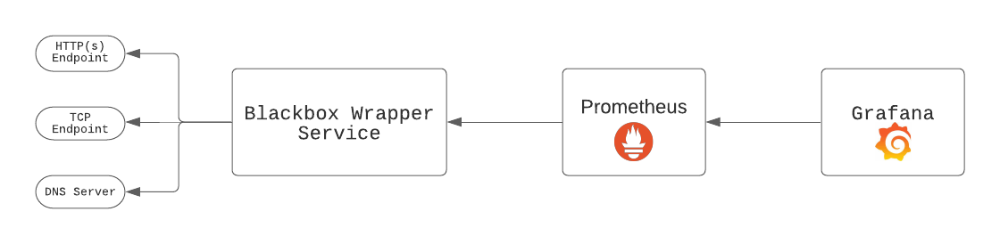
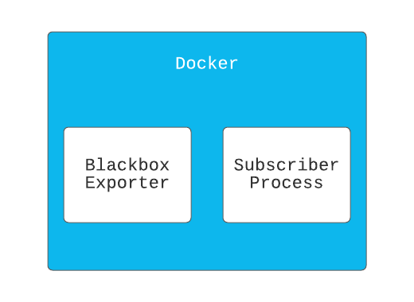
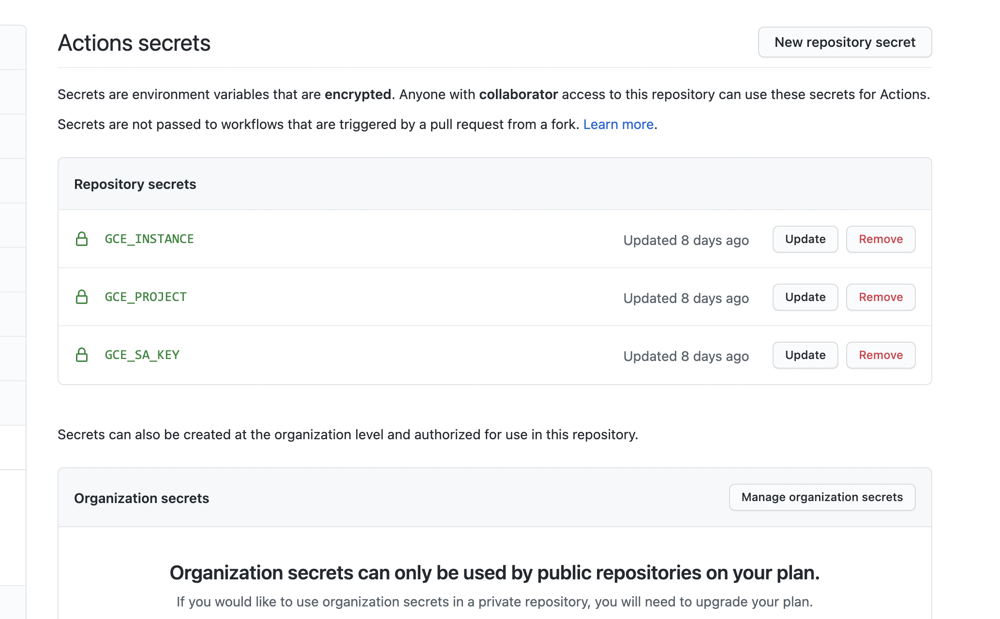
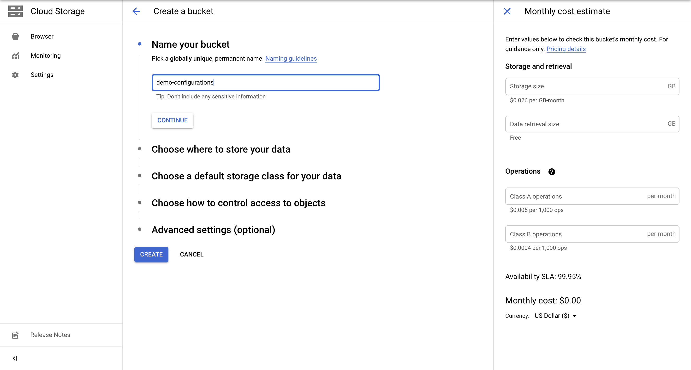
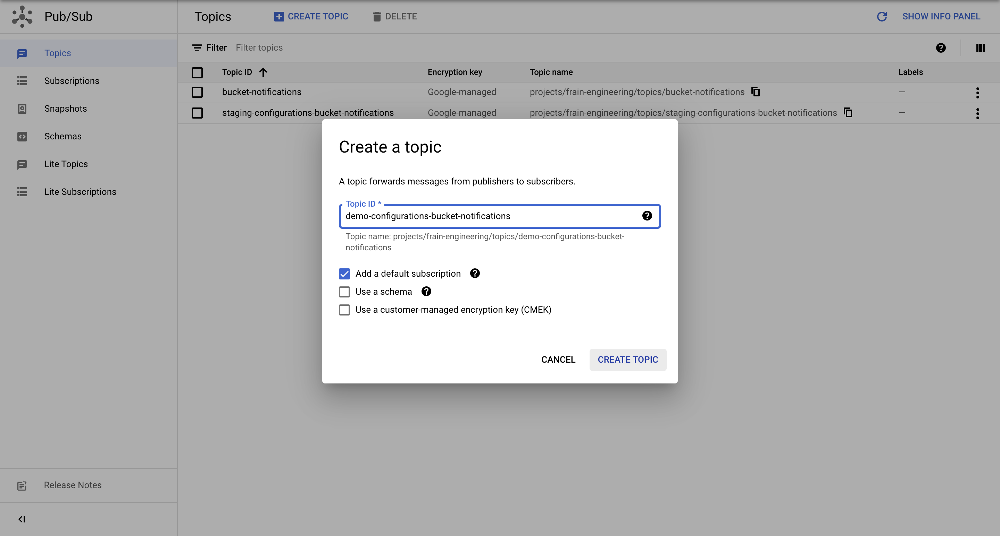
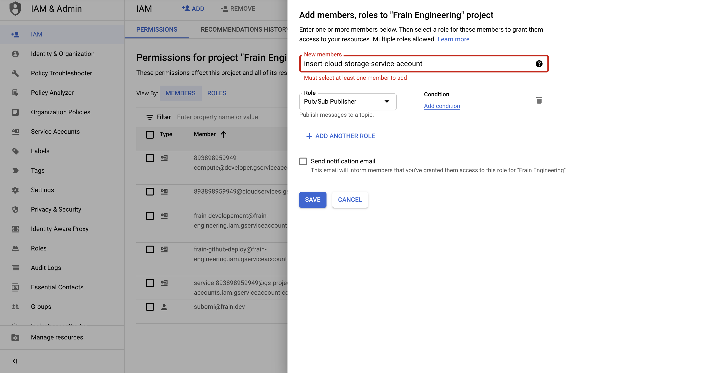
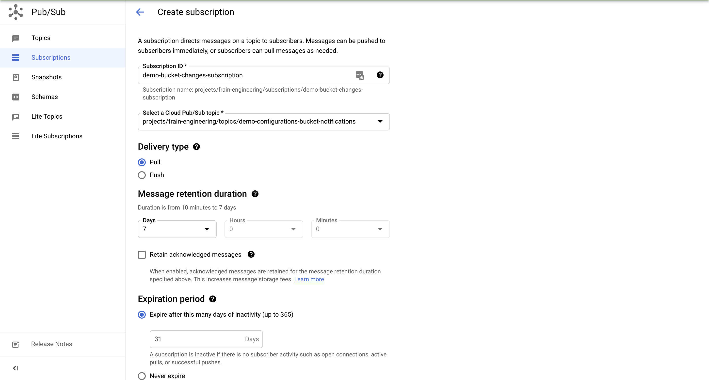

# How to use GCE, Cloud Storage and PubSub to build an uptime monitoring system in Ruby

Uptime monitoring is monitoring technique used to monitor the availability of websites, APIs and servers. The monitor probes the given endpoint in a specified interval to determine if the endpoint is available or not. The goal is to achieve the availability contract specified in the system's SLA and determine the difference when the contract isn't met.

In this article, we're going to build an uptime monitoring system based off prometheus [blackbox_exporter](https://github.com/prometheus/blackbox_exporter). While it might be trivial to build a custom HTTP monitoring system, building a wrapper around the exporter enables us access to LOTs of other probe techniques to monitor other elements of our system faster. 

This article, includes the use of several technologies and I'll like to describe each component before we dive into the details of the uptime system in the first place.

### What is Google Compute Engine (GCE) ?

Compute engine is Google's cloud compute service offering. This is similar to AWS's EC2 compute offering. It's secure and customisable to fit various workloads ranging from small machines (supporting up to 32 vCPUs and 128 GB memory) to standard machines (supporting up to 224 vCPUs and 896 GB memory) and other high end machines for intensive workloads. It is computer on-demand to scale to your needs per-time.

GCE supports different deployment mechanisms for app deployment - Containers, Instance templates, Managed Instance Groups etc. For the purpose of this article, we'll bundle our Ruby uptime monitor into a docker container for deployment, which we'll see how later on. 

### What is Cloud Storage?

Cloud Storage is a highly-available object storage service by the Google Cloud. This is similar to AWS's S3 service. Cloud Storage provides lots of storage features that enables several use-cases for modern apps. Getting started with Cloud Storage in Ruby we use the `google-cloud-storage` gem to authenticate and upload and download files from Cloud Storage. Let's see an example: 

```ruby
require 'google/cloud/storage'

def upload_file bucket_name:, file_path:, file_name: nil
	storage = Google::Cloud::Storage.new
	bucket = storage.bucket bucket_name

	file = bucket.create_file file_path, file_name
end

def download_file bucket_name: file_path, file_name: nil
	storage = Google::Cloud::Storage.new
	bucket = storage.bucket bucket_name
	file = bucket.file file_name

	file.download file_path
end
```

**Note**: You need to setup `GOOGLE_APPLICATION_CREDENTIALS` in your environment to point to the right service account key. All google client gems search for that environment variable for authorization, else you need to pass auth specific parameters to `Google::Cloud::Storage.new`. If you're running your app in a GCE VM, however, this is already setup in the environment. 

### What is Cloud PubSub?

Cloud PubSub is publish/subscribe messaging service by Google Cloud. This form of communication is used to facilitate asynchronous service-to-service communication. This is similar to AWS's SNS. Building systems with asynchronous communication can help us improve our system's  performance, scalability and reliability. Getting started with Cloud PubSub in Ruby we use the `google-cloud-pubsub` gem to authenticate, publish & listen on events. Let's see an example:

```ruby
require 'google/cloud/pubsub'

def publish_message topic_id:, message: nil
	pubsub = Google::Cloud::Pubsub.new
	topic = pubsub.topic topic_id

	topic.publish_async message do |result|
		raise "Failed to publish message" unless result.succeeded?
		puts "Message published asynchronously"
	end

	topic.async_publisher.stop.wait!
rescue StandardError => e
	puts "Received error while publishing: #{e.message}"
end

def receive_message subscription_id: nil, wait_time: 200.seconds
	pubsub = Google::Cloud::Pubsub.new

	subscription = pubsub.subscription subscription_id
	subscriber = subscription.listen do |received_message|
		puts "Received message: #{received_message.data}"
		received_message.acknowledge!
	end

	subscriber.start
	sleep wait_time
end
```

**Note**: The authentication described for Cloud Storage applies here as well.

Leveraging on Cloud Storage & PubSub we can build very interesting solutions - often times, we want to upload an object and track updates - it's lifecycle - create, update and delete and take certain actions based on certain events. If this still seems abstract let's look at two use-cases: 

- Image Service: Building an image service like [Cloudinary](https://cloudinary.com/) that  provides image & video storage as well as transformations on these data. While Cloud Storage can help store and version the data, with PubSub we can listen for events from a bucket and perform certain preprocessing on the data even before the customer requests for a pre-processed version.
- Distribute Configuration Files: A common problem in Infrastructure engineering is to rollout configurations to several servers and provide easy rollbacks. Imagine we wanted to have a central server responsible for server configurations, and we wanted to update the configuration once and distribute the config to a fleet of our servers. Using Cloud Storage & Cloud PubSub we can build agents on our servers that listen through PubSub to get Object notifications and take action based off those events & and in the event that it was a bad change (Wrong configuration change is actually the reason of many popular downtimes 😩 ) we can rollback with Object versioning.

In this article, we'll be building a ruby wrapper for [blackbox_exporter](https://github.com/prometheus/blackbox_exporter) using the final use-case described above. The wrapper will run the exporter in one process and run another process to watch for configuration changes from a bucket in GCP, then live reload the exporter. Are you ready? Let's have fun!

### What is the Blackbox Exporter?

Blackbox Exporter is an open-source tool built by the prometheus team to probe endpoints over HTTP, HTTPS, DNS, TCP and ICMP. The exporter should be deployed alongside a Grafana and Prometheus deployment. The complete setup looks like the below: 



The Blackbox wrapper probes all configured endpoints, and Prometheus scrapes the exporter like it will scrape any other target, then Grafana retrieves data from Prometheus to be graphed.  We run the exporter binary like - `blackbox_exporter --config.file blackbox.yml`. The blackbox exporter also allows us to live reload the exporter with a new configuration without having to shutdown the binary and restart it. This can be very useful when scraping endpoints with seconds interval.

### BlackboxWrapper Service Spec

Before deep diving into the code, let's try to highlight the Service Spec:

- The `BlackboxWrapper` Service will run two processes;
    - First process runs `blackbox_exporter` binary.
    - Second process listens for bucket changes from GCP & restarts first process.
- The Service will be deployed as a docker image - this will enable us package the service alongside the `blackbox_exporter` binary*



### Writing The Wrapper

Let's build the wrapper

1. Create App directory and enter the directory

    ```bash
    mkdir blackbox-wrapper && cd blackbox-wrapper
    ```

2. Create your Gemfile and Install

    Like our standard ruby application we'll be using `bundler` to manage our wrapper's dependencies

    ```ruby
    source "https://rubygems.org"

    git_source(:github) {|repo_name| "https://github.com/#{repo_name}" }

    ruby '2.7.2'

    gem 'google-cloud-storage'
    gem 'google-cloud-pubsub'
    gem 'rake'
    gem 'pry'
    ```

    ```bash
    bundle install
    ```

3. Create your main file - `app.rb`

    This file will act as the entrypoint to our service. Since we are going to be deploying our app in a container, this file will be specified in the `CMD` command in our `Dockerfile` later on.

    ```bash
    touch app.rb
    ```

4. Create Dockerfile 

    While some items have been omitted from this file on purpose. Below highlights the critical components necessary for this article:

    ```docker
    FROM ruby:2.7.2

    RUN mkdir /app
    WORKDIR /app
    COPY . .

    # Install other dependencies
    ...

    # Download & Install blackbox exporter
    RUN curl -SL \
        https://github.com/prometheus/blackbox_exporter/releases/download/v0.18.0/blackbox_exporter-0.18.0.linux-386.tar.gz | \ 
        tar xvz -C /tmp && \ 
        mv /tmp/blackbox_exporter-0.18.0.linux-386/blackbox_exporter /usr/local/bin && \
        mkdir /etc/blackbox && \
        mv /tmp/blackbox_exporter-0.18.0.linux-386/blackbox.yml /etc/blackbox/

    # Specify entrypoint.
    CMD ["bundle", "exec", "ruby", "app.rb" ]
    ```

    From the above we should note the following: 

    - We use a ruby image - `ruby:2.7.2` as a base image with ruby installed.
    - We installed `blackbox_exporter` binary and moved it to a directory accessible from our `PATH`
    - We specified the entrypoint of the container to run `app.rb` on container startup.
5. Let's write the wrapper service.

    ```ruby
    require 'rubygems'
    require 'bundler/setup'
    require "google/cloud/pubsub"
    require "google/cloud/storage"

    CONFIG_BUCKET = ENV['BUCKET_NAME']
    TOPIC = ENV['PUBSUB_TOPIC']
    TOPIC_SUBSCRIPTION = ENV['TOPIC_SUBSCRIPTION']

    class ProcessNotification

      def initialize(file, attr, blackbox_exporter)
        @file = file
        @attr = attr
        @blackbox_exporter = blackbox_exporter
      end

      def call
        return if @attr['eventType'] == 'OBJECT_DELETE'

        @blackbox_exporter.write @file
        @blackbox_exporter.reload
      end
    end

    class BlackBoxExporter
      CONFIG_FILE = '/etc/blackbox/blackbox.yml'

      def initialize
        @blackbox_pid = nil
      end

      def start
        return unless @blackbox_pid.nil?

        @blackbox_pid = fork do 
          exec('blackbox_exporter', '--config.file', CONFIG_FILE)
        end
      end

      def write(file)
        file.download CONFIG_FILE 
      end

      def reload
        # Send SIGHUP signal
        Process.kill('HUP', @blackbox_pid)
      end

      def shutdown
        Process.kill('KILL', @blackbox_pid)
      end
    end

    class Subscriber
      class NotificationConfigError < StandardError
      end

      SUPPORTED_FILE_TYPES = ['blackbox.yml']

      def initialize(blackbox_exporter)
        @pubsub = Google::Cloud::Pubsub.new
        @storage = Google::Cloud::Storage.new
        @subscription_name = ENV['TOPIC_SUBSCRIPTION']  # Retrieve a subscription
        @bucket = @storage.bucket CONFIG_BUCKET
        @subscription = @pubsub.subscription @subscription_name
        @blackbox_exporter = blackbox_exporter
      end

      def listen
        create_notification_config

        puts "Starting subscriber"

        @subscriber = @subscription.listen do |received_message|
          process_notification(received_message)
        end

        @subscriber.on_error do |exception|
          process_exception(exception)
        end

        @subscriber.start
      end

      def process_notification(received_message)
        data = received_message.message.data
        published_at = received_message.message.published_at
        attributes = received_message.message.attributes
        
        puts "Data: #{data}, published at #{published_at}, Attr: #{attributes}"
        received_message.acknowledge!
        
        parsed_data = JSON.parse(data)
        file_name = parsed_data['name']
        return unless SUPPORTED_FILE_TYPES.include?(file_name)

        file = @bucket.file file_name
        process_notification = ProcessNotification.new(file, attributes, @blackbox_exporter)
        process_notification.call
      end

      def process_exception(exception)
        puts "Exception: #{exception.class} #{exception.message}"
      end

      def shutdown
        @subscriber.stop!(10)
      end

      def create_notification_config
        topic = @pubsub.topic TOPIC

        notification_exists = @bucket.notifications.count == 1
        unless notification_exists
          @bucket.notifications.each do |notification|
            notification.delete
          end
        end

        @bucket.create_notification topic.name

      rescue StandardError => e
        raise NotificationConfigError, e.message
      end
    end

    class BlackboxWrapper
      def initialize
        @blackbox_exporter = BlackBoxExporter.new
        @subscriber = Subscriber.new(@blackbox_exporter)
      end

      def start
        @blackbox_exporter.start
        @subscriber.listen

        at_exit do 
          @blackbox_exporter.shutdown
          @subscriber.shutdown
        end

        # Block, letting processing threads continue in the background
        sleep
      end
    end

    blackbox_wrapper = BlackboxWrapper.new
    blackbox_wrapper.start
    ```

    While the above is a lot, let's try to break it down starting from the bottom:

    - `BlackboxWrapper`: This class is the entrypoint to our service - the `.start` method does the following:
        - Starts the `blackbox_exporter` binary in a different process to start probing endpoints.
        - Starts the `Subscriber` in another process to listen for bucket changes.
        - It then calls `sleep` in the main process to ensure the app runs infinitely.
    - How does the `BlackboxExporter` work?
        - The `.start` method uses the `exec`  Kernel method to run the `blackbox_exporter` binary in another process.
        - The `.reload` method sends the `SIGHUP` signal to live reload the `blackbox_exporter` binary with the new configuration. As you can note from the `ProcessNotification` class that a new configuration file is written to the configuration file location before the exporter is reloaded.
    - How does the `Subscriber` work?
        - The `.listen` method starts with creating a `NotificationConfiguation`. A `NotificationConfiguration` is a rule that specifies 3 things:
            - A topic in pub/sub to receive notifications.
            - The event that triggers notification to be sent. Click [here](https://cloud.google.com/storage/docs/pubsub-notifications#events) to view the various event types that can trigger notification.
            - The information contained within notifications.
        - The `#create_notification_config` method also ensures that there's just one `NotificationConfiguration` else it will delete everything and create one.  This ensures that notifications come in just once.
        - The `.listen` method also calls `@subscription.listen` to start listening for notification changes from the bucket we're subscribed to. Note that this runs infinitely in another process as explained above.
        - The `#process_notification` method is called for every notification update sent. Note that we have `SUPPORTED_FILE_TYPES`which we use to identify files in the bucket we care about else do nothing about the rest.
    - `ProcessNotification`: This is responsible for processing notifications, downloading the updated configuration, writing it to file and reloading the `blackbox_exporter` binary.

### Run Service Locally

To run the service locally & test - run the following in the root of the app directory:

```bash
export BUCKET_NAME='{insert-bucket-name}'
export PUBSUB_TOPIC='{insert-pubsub-topic}'
export TOPIC_SUBSCRIPTION='{insert-subscription-name}'
export GOOGLE_APPLICATION_CREDENTIALS='{insert-path-to-service-key-json}'

bundle exec ruby app.rb
```

Let's see a working demo: 

[Demo](demo.mp4)

### Deploying our Service to Google Compute Engine.

Like many several things in the cloud there are many ways to achieve the same result, but modern software engineering encourages CI/CD processes for several good reasons as such we be focusing on deploying our service from Github Actions using [setup-gcloud](https://github.com/google-github-actions/setup-gcloud)

1. Let's setup our Deployment File (.github/workflows/deploy.yml)

    ```yaml
    name: Build and Deploy to Google Compute Engine

    on:
      push:
        branches:
        - main

    env:
      PROJECT_ID: ${{ secrets.GCE_PROJECT }}
      GCE_INSTANCE: ${{ secrets.GCE_INSTANCE }}
      GCE_INSTANCE_ZONE: us-central1-a
      BUCKET_NAME: demo-configurations
      PUBSUB_TOPIC: demo-configurations-bucket-notifications
      TOPIC_SUBSCRIPTION: demo-bucket-changes-subscription

    jobs:
      setup-build-publish-deploy:
        name: Setup, Build, Publish, and Deploy
        runs-on: ubuntu-latest

        steps:
        - name: Checkout
          uses: actions/checkout@v2

        # Setup gcloud CLI
        - uses: google-github-actions/setup-gcloud@master
          with:
            version: '290.0.1'
            service_account_key: ${{ secrets.GCE_SA_KEY }}
            project_id: ${{ secrets.GCE_PROJECT }}

        # Configure Docker to use the gcloud command-line tool as a credential
        # helper for authentication
        - run: |-
            gcloud --quiet auth configure-docker

        # Build the Docker image
        - name: Build
          run: |-
            docker build --tag "gcr.io/$PROJECT_ID/$GCE_INSTANCE-image:$GITHUB_SHA" .

        # Push the Docker image to Google Container Registry
        - name: Publish
          run: |-
            docker push "gcr.io/$PROJECT_ID/$GCE_INSTANCE-image:$GITHUB_SHA"

        - name: Deploy
          run: |-
            gcloud compute instances update-container "$GCE_INSTANCE" \
              --zone "$GCE_INSTANCE_ZONE" \
              --container-image "gcr.io/$PROJECT_ID/$GCE_INSTANCE-image:$GITHUB_SHA" \
              --container-env "BUCKET_NAME=$BUCKET_NAME,PUBSUB_TOPIC=$PUBSUB_TOPIC,TOPIC_SUBSCRIPTION=$TOPIC_SUBSCRIPTION"
    ```

    - Note the `--container-env` flag set in the Deploy phase, this ensures we pass necessary environment variables from Github Actions secrets to the container in a secure fashion.
2. Setup Secrets for Github Actions



3. Environment Variables: We set environment variables for our container with the `--container-env` flag. Since we are setting it from Github actions we can either use secrets for sensitive data or env variables for non-sensitive data.
4. Create Bucket in GCP Console.



5. Create PubSub Topic in GCP Console.



6. Give the service agent of the cloud storage bucket - the IAM role - `pubsub.publisher` in console. Each project has an associated Cloud Storage service account responsible for some background actions like PubSub notifications etc. Click [here](https://cloud.google.com/storage/docs/getting-service-agent) to know how to find it. 



7. Create Subscription in GCP Console.



Voila 🎉 Our Cloud Function has been deployed successfully. 

## Conclusion

If you made it this far, you deserve a cookie 🍪 . While I think this a first version of a potential great solution, with multiple optimisations to be achieved, e.g. we can potentially achieve the following:

- Deploy the blackbox_exporter as a serverless function to support multiple regions, which is ideal for uptime monitoring, and deploy a master server responsible for updating the bucket configuration in Cloud Storage.
- Potentially, from the previous point we can abstract this into an app that integrates to popular cloud providers to achieve same functionality - hence making it cloud-agnostic. P.S: Popular cloud providers (GCP, AWS, & Azure) provide same functionalities across.
- In the next article, we'll build upon this solution to provide - rollbacks with Cloud Storage object versioning this will enable us recover from updating the configuration with wrong updates.

* Deploying with Docker simply solves the packaging problem for us, but as perhaps already know there are various ways to package services, I choose docker in this article for the sake of simplicity.

## Glossary

- **Prometheus** is an open-source systems monitoring and alerting toolkit. It includes a server that scrapes and stores time series data, client libraries for instrumenting application code, an alertmanager to handle alerts.
- **Grafana** is a visualisation system that allows you to query, visualise and alert on and understand your metrics regardless of where they are stored.
- **Blackbox Exporter** is an open-source tool built by the prometheus team to probe endpoints over HTTP, HTTPS, DNS, TCP and ICMP.

