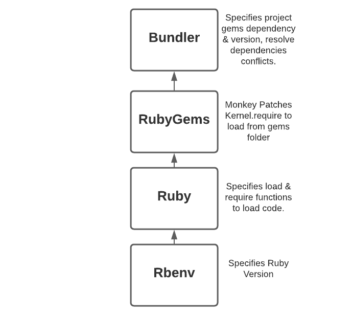
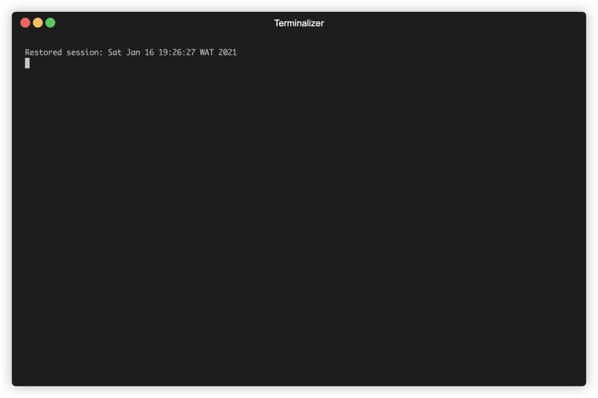

# Understanding Rbenv, RubyGems & Bundler

Managing dependencies in Ruby usually involves specifying Ruby versions and gem versions that our project relies upon. In my experience working with Ruby, debugging dependencies has been one of my biggest pain point. Although failures aren't common because many things "just work", but when things go wrong, they're usually unnecessarily hard to debug and fix. In this article, I will lay out the pieces involved in dependency management in Ruby. This will assist in debugging these strange issues when they occur.



### Ruby Code Loading

The Ruby language by default provides 2 major methods for loading code defined elsewhere: `load` & `require`. 

```ruby
load 'json.rb'
require 'json.rb'
require_relative 'json.rb'
```

Both methods of loading accept both absolute & relative paths as arguments. However, there are 2 differentiating factors

1. Multiple calls to `load` will re-execute the file, whereas multiple calls to `require` will not re-execute the file rather will return `false`.
2. Calls to `load` resolves only to absolute & relative paths. Calls to `require` checks up on the `$LOAD_PATH` when the path doesn't resolve to an absolute path.

A third variant is `require_relative` which uses relative paths to require code relative to the current files location not the ruby's process working directory.

## Rbenv

A version manager is a tool used to manage and easily switch between versions of our interpreter (In this case ruby) and specify the location to find respective gems for our project. Version managers are largely language agnostic tools and various languages have their respective implementations E.g. [Nvm](https://github.com/nvm-sh/nvm), [n](https://github.com/tj/n) for Node.js, [pyenv](https://github.com/pyenv/pyenv) for Python, and [Rbenv](https://github.com/rbenv/rbenv), [rvm](https://rvm.io) and [chruby](https://github.com/postmodern/chruby) for Ruby. Now let's take `rbenv` for a spin, shall we? 

### Install Ruby Version

We use the command `rbenv install` to install any version of ruby

```bash
# Install ruby 2.6.1
$ rbenv install 2.6.1
Downloading openssl-1.1.1i.tar.gz...
-> https://dqw8nmjcqpjn7.cloudfront.net/e8be6a35fe41d10603c3cc635e93289ed00bf34b79671a3a4de64fcee00d5242
Installing openssl-1.1.1i...
Installed openssl-1.1.1i to /home/directory/.rbenv/versions/2.6.1

Downloading ruby-2.6.1.tar.bz2...
-> https://cache.ruby-lang.org/pub/ruby/2.6/ruby-2.6.1.tar.bz2
Installing ruby-2.6.1...
ruby-build: using readline from homebrew
Installed ruby-2.6.1 to /home/directory/.rbenv/versions/2.6.1

# Check Installation 
$ rbenv versions # Shows all versions installed. 
  system
  2.6.1

# Lookup versions available for installation
$ rbenv install -L
1.8.5-p52                                                                                                                                                                                                                                     
1.8.5-p113                                                                                                                                                                                                                                    
1.8.5-p114                                                                                                                                                                                                                                                                                                                                                                                                                                                                          
...
2.7.0-rc1                                                                                                                                                                                                                                     
2.7.0-rc2                                                                                                                                                                                                                                     
2.7.0                                                                                                                                                                                                                                         
...
truffleruby+graalvm-20.1.0
truffleruby+graalvm-20.2.0
truffleruby+graalvm-20.3.0

# The full list above amounts to about 500 versions, scrolling through the entire list is a lot. 
# The command below is an easy shortcut to find your specific version with fzf.
$ rbenv install `rbenv install -L | fzf`

```

### Switch Between Versions

There are a number of ways to identify how to switch between versions of ruby, invariably, `rbenv` does the following;

- Checks the `RBENV_VERSION`.
- Searches for a `.ruby-version` file in the script's directory and it's parent till it hits the root directory.
- Searches for a `.ruby-version` file in `$PWD` and it's parent directories till it hits the root directory.
- Uses the global file `~/.rbenv/version`.

The priority goes from top to bottom.  `~/.rbenv/version` is the final fallback and treated as the global version. See below

```ruby
# Inside First Project Root 

# Select ruby version for project
$ touch .ruby-version && echo "2.7.1" >> .ruby-version

# Verify selected version
$ ruby --version 
ruby 2.7.1p83 (2020-03-31 revision a0c7c23c9c) [x86_64-darwin20] # Result

$ rbenv version
2.7.1 (set by /path/to/current/directory/.ruby-version) # Result

# Change selected version
$ : >> .ruby-version && echo "2.6.1" >> .ruby-version

# Verify selection change
$ ruby --version 
ruby 2.6.1p33 (2019-01-30 revision 66950) [x86_64-darwin20] # Result

$ rbenv version 
2.6.1 (set by /path/to/current/directory/.ruby-version)

# Change selection with RBENV_VERSION while .ruby-version is present
$ export RBENV_VERSION=2.5.1

# Verify selection change
# .ruby-version is ignored.
$ ruby --version
ruby 2.5.1p57 (2018-03-29 revision 63029) [x86_64-darwin20] # Result

$ rbenv version
2.5.1 (set by RBENV_VERSION environment variable) # Result

# Change to a version that is not installed & remove RBENV_VERSION
$ unset RBENV_VERSION & : >> .ruby-version && echo "2.4.1" >> .ruby-version 

# Verify selection change
$ ruby --version
rbenv: version `2.4.1' is not installed (set by full/path/to/current/directory/.ruby-version) # Result
```

### Shims & Rehashing

These are two concepts to be properly understood to be able to debug `rbenv` effectively. 

- **Shims:** These ****are lightweight bash scripts that exist in your `PATH` to intercept commands and route them to the appropriate version for execution. On a high level, every command (e.g. `rspec`) is translated into `rbenv exec rspec`. See details below;
    - Firstly, `rbenv` creates a shim for all commands (`rspec`, `bundle` etc.) across all installed ruby versions to intercept calls to the CLI regardless of version. These shims can be found at `~/.rbenv/shims`. Every shim contains the same bash script as below:

        ```bash
         #!/usr/bin/env bash
         1 set -e
         2 [ -n "$RBENV_DEBUG" ] && set -x
         3  
         4 program="${0##*/}"
         5 if [ "$program" = "ruby" ]; then
         6    for arg; do
         7      case "$arg" in
         8      -e* | -- ) break ;;
         9      */* )
         10        if [ -f "$arg" ]; then
         11         export RBENV_DIR="${arg%/*}"
         12         break
         13       fi
         14       ;;
         15     esac
         16   done
         17 fi
         18 
         19 export RBENV_ROOT="/home/directory/.rbenv"
         20 exec "/usr/local/Cellar/rbenv/1.1.2/libexec/rbenv" exec "$program" "$@"
        ```

    - Secondly, the script above roughly translates to the following;
        - If the program name is `ruby` with an argument `-e`
            - Translate to `rbenv exec ruby <args>`
        - If the program name is `ruby` with a path to a script,
            - Set the `RBENV_DIR` to the the script's directory. This enables `rbenv` search for `.ruby-version` in the script's directory, before the `$PWD`. In a case where a `.ruby-version` is specified in both locations, `rbenv` selects the script's directory.
        - If the program name is not ruby
            - Translate to `rbenv exec <program-name> <args>`
    - Finally, `rbenv exec <command-name> <args>` identifies the correct version to pass the command to by checking the `RBENV_VERSION` environment variable. Remember `RBENV_VERSION` is set by the algorithm defined above.

    **Caveat:** Shims on your `PATH` must be prepended, this ensures they're the first point of contact for your ruby executables and they can properly intercept. The best way I found to understand your `PATH` setup and know if your shims are intercepting properly or not is 

    ```ruby
    # bash
    $ which -a bundle

    # Output
    /path/to/home/.rbenv/shims/bundle
    /usr/bin/bundle
    ```

    `which -a bundle`: this naively looks through your `PATH` and prints out in the order which it is found, locations where `bundle` can be found. If anything is printed before anything in `~/.rbenv/shims`. It means your shims aren’t setup properly. `rbenv which bundle` won't reveal this because that command works in context of `rbenv` not searching your `PATH`.

- **Rehashing:** This is the process of creating shims. When you newly install a ruby gem that provides an executable like `rspec` , you need to run `rbenv rehash` to create the shim, so subsequent calls to `rspec` can be intercepted by `rbenv` and passed on to the appropriate ruby version.

### RubyGems

Next is RubyGems. From the official ruby site; RubyGems is a Ruby packaging system designed to facilitate the creation, sharing and installation of libraries (in some ways, it is a distribution packaging system similar to, say, apt-get, but targeted at Ruby software). RubyGems is the de-facto method for sharing gems. They are usually installed at  `~/.rbenv/versions/{version-number}/lib/ruby/gems/{minor-version}/`, or it's variant depending on which version manager is used. Ruby's default require method `Kernel.require` doesn't provide any mechanism to load up gems from the Gems installation directory. RubyGems monkey-patches `Kernel.require` to 

- First, search for gems in the `$LOAD_PATH`.
- If not found, search for gems in the `GEMS INSTALLATION DIRECTORY`.
    - Once found, add the path to `$LOAD_PATH`.

This works "natively" because Ruby comes with RubyGems by default since version 1.9, previous Ruby versions required RubyGems to be installed by hand. Although this works natively, it is also important to know this difference when debugging.

A gem is a bunch of related code to solve a specific problem. To install a gem & get information about the gem environment: 

```bash
$ gem install gemname
```

```bash
$ gem env

# Output
RubyGems Environment:  
	- RUBYGEMS VERSION: 3.1.2  
	- RUBY VERSION: 2.7.1 (2020-03-31 patchlevel 83) [x86_64-darwin20]  
	- INSTALLATION DIRECTORY: /path/to/home/.rbenv/versions/2.7.1/lib/ruby/gems/2.7.0  
	- USER INSTALLATION DIRECTORY: /path/to/home/.gem/ruby/2.7.0  
	- RUBY EXECUTABLE: /path/to/home/.rbenv/versions/2.7.1/bin/ruby  
	- GIT EXECUTABLE: /usr/bin/git  
	- EXECUTABLE DIRECTORY: /path/to/home/.rbenv/versions/2.7.1/bin  
	- SPEC CACHE DIRECTORY: /path/to/home/.gem/specs  
	- SYSTEM CONFIGURATION DIRECTORY: /path/to/home/.rbenv/versions/2.7.1/etc  
	- RUBYGEMS PLATFORMS:    
		- ruby    
		- x86_64-darwin-20  
	- GEM PATHS:     
		- /path/to/home/.rbenv/versions/2.7.1/lib/ruby/gems/2.7.0     
		- /path/to/home/.gem/ruby/2.7.0  
	- GEM CONFIGURATION:     
		...
	- REMOTE SOURCES:     
		- https://rubygems.org/  
	- SHELL PATH:     
		- /path/to/home/.rbenv/versions/2.7.1/bin
```

How does RubyGems actually solve this problem? It monkey patches the `Kernel`'s require system with its own `require` method. With this in-place, when `require honeybadger` is called, it searches through the gems folder for `honeybadger.rb` and activates the gem when found. 

- E.g. `require 'honeybadger'` produces something similar to:
    - `spec = Gem::Specification.find_by_path('honeybadger')`
    - `spec.activate`

Activating a gem simply means, putting it up in the `$LOAD_PATH`. RubyGems also helps download all gems dependencies before downloading the gem itself.  

Also, Rubygems ships with a nice feature to enable you open the associated gem's directory with `gem open <gem-name>`, E.g.



This easily allows us find/trace the specific version of the gem our app is referencing. 

### Bundler

At this layer, Bundler helps us easily specify all our project dependencies and optionally specify a version for each. Then it resolves our gems, installs it & its' own dependencies. Building real world applications pre-bundler came with a myriad of challenges like

- Our applications exist with numerous dependencies, and these dependencies in themselves have various other dependencies and their respective versions. Installing the wrong version of one gem will easily break our app, and fixing this involved lots of tears.
- Also, two(2) of our dependencies can refer to the same third level dependency. Finding compatibility was an issue, if there was any, was a problem.
- Where we have multiple applications on the same machine, with various dependencies, our application can access any & all gems installed on the machine, this goes against the principle of [least privilege](https://en.wikipedia.org/wiki/Principle_of_least_privilege) and exposes our application to all gems installed on the machine malicious or not.

Bundler solves all 3 problems and gives us a sane way to manage our app dependencies by doing the following;

- Bundler resolves dependencies and generates a lockfile

    ```ruby
    # Gemfile
    gem 'httparty'
    ```

    If we run `bundle` or `bundle install`, it will generate the lockfile below: 

    ```ruby
    GEM
      specs:
        httparty (0.18.1)
          mime-types (~> 3.0)
          multi_xml (>= 0.5.2)
        mime-types (3.3.1)
          mime-types-data (~> 3.2015)
        mime-types-data (3.2020.1104)
        multi_xml (0.6.0)

    PLATFORMS
      ruby

    DEPENDENCIES
      httparty

    BUNDLED WITH
       2.1.4
    ```

    From the above, bundler generates the version of `httparty` to be installed as well as it's own dependencies in the `Gemfile.lock.` This file is the blueprint of our app dependencies and should be checked into version control. It ensures that our project dependencies are consistent across environments (development, staging or production). 

- Bundler resolves compatibility among dependencies

    It resolves the dependencies for `httparty` by finding the suitable version for it's dependencies and specifying those. Bundler also tries to resolve dependencies between gems. E.g.

    ```ruby
    # Gemfile
    gem 'httparty' # That relies on gem 'mime-types', '>= 3.0.1, < 4.0.1'
    gem 'rest-client' # That relies on gem 'mime-types', '>= 2.0.1, < 3.0'
    ```

    The example above is arbitrary and will result in an error like: 

    ```ruby
    Bundler could not find compatible versions for gem "mime-types":
    In Gemfile:
    	httparty was resolved to 0.18.1, which depends on 
    		mime-types ('>= 3.0.1, < 4.0.1')

    	rest-client was resolved to 2.0.4, which depends on 
    		mime-types ('>= 2.0.1, < 3.0')
    ```

    This is because two gems have dependencies that are not compatible and cannot be automatically resolved. 

- Bundler restricts access to gems installed but not specified in our `Gemfile`. In a sample gemfile like:

    ```ruby
    # Gemfile
    gem 'httparty'

    # irb
    require 'rest-client'

    # raises
    LoadError (cannot load such file -- rest-client)
    ```

    This ensures that only the dependencies specified in our `Gemfile` can be required by our project.

- Bundle exec

    When you run `rspec` in a project directory, there is a possibility of running a different version other than what was specified in the `Gemfile`. This is because the most recent version will be selected to run vs. the version specified in the `Gemfile`. `bundle exec rspec` ensures `rspec` is run in the context of that project i.e. The gems  specified in the Gemfile.

- Bundle binstubs

    Often times, we read articles where we run commands like `./bin/rails` this command is similar to `bundle exec rails`. Binstubs are wrappers around ruby executables to ease the usage of `bundle exec`. 

    - To generate a binstub run: `bundle binstubs gem-name`. This creates a binstub in the `./bin` folder but can be configured with the `--path` directory if set.

### References

[How Do Gems Work?](https://www.justinweiss.com/articles/how-do-gems-work/)

[Rbenv](https://github.com/rbenv/rbenv)

[RubyGems](https://rubygems.org)

[Bundler](https://bundler.io)
