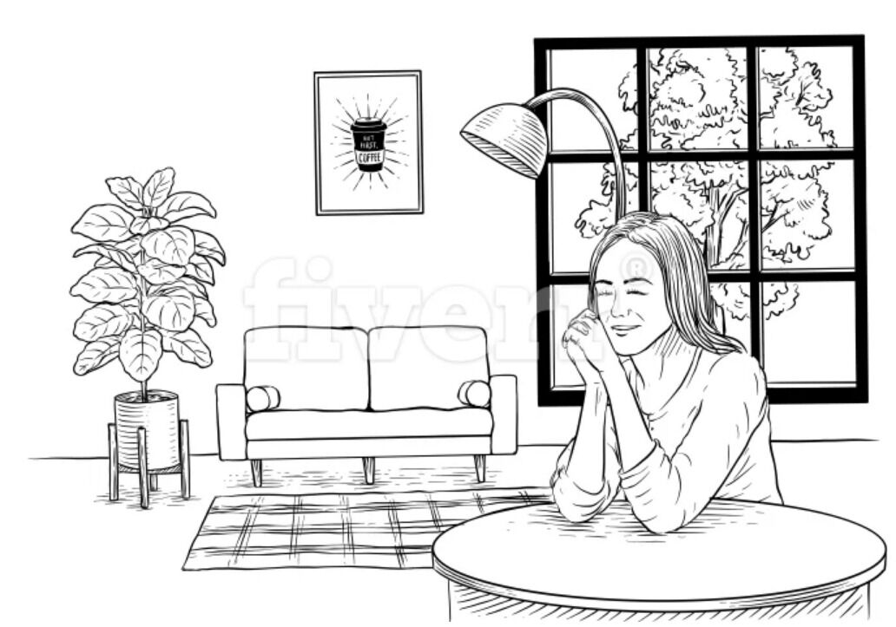

# Honeybadger Blog Style Guide

Think of blog posts like chapters in a printed technical book.
If you look at a technical book you'll see a very simple layout made up of text, code, headings and an occasional list.
We take a similar approach with our blog.

This isn't just for asthetics.
We need blog posts to:

- Look good on mobile
- Look good in print
- Translate easily to formats like EPUB

By sticking to a simple layout we get these things for free.

## Markdown

Blog posts are written in github-flavored markdown.
Please restrict yourself to the subset of markdown documented in this guide.

If you find yourself stretching the limits of markdown our our CSS to format your post:

- Stop. Breathe.
- Remind yourself that one-off formatting often breaks mobile and print.
- Remind yourself that this is a chapter in a book, not a web app.

Then edit your content to fit the existing design.

Please don't put raw HTML or third-party embedded widgets in your blog posts.

## Subheadings

Subheadings are just like subheadings in a book.
Their job is to concisely describe the upcoming text.

- Shoot for one subheading every 200 words or so. More is better.
- Title Case. No Punctuation. 45 characters or less
- Only use H2s

Here's an example of a good subheading:

```markdown
## My Subheading
```

Here's an example of what to avoid:

```markdown
### It was the best of times, it was the worst of times, it was the age of wisdom, it was the age of foolishness, it was the epoch of belief, it was the epoch of incredulity
```

## Paragraphs

Paragraphs work like you might expect.
Prefer many short paragraphs over fewer long paragraphs.

Use as little formatting as possible inside paragraphs.
Try to stick to the following:

```markdown
`short code fragment`
[link text](href)
_text in italics_
**bold text**
```

Avoid putting images inside of text paragraphs.

## Block Images

Think of how images are displayed in a technial book.
They take up the full width of the page and are often captioned.

The displayed size will depend on the user's screen size.

- Largest: Around 700px
- Smallest: Around 200px

**For sharp images on HIDPI screens, images should be 1500px wide.**

If you would like to caption your image, you can do it like so:

```markdown

_This is the caption_
```

And here's what that looks like:


_This an image caption created by putting an &lt;em&gt; directly below an image. To do an em in markdown, surround it by underscores. If it becomes too long the line will wrap in an appropriate way._

## Inline Images

Block images are always preferred, but sometimes an image is too small to display full-width.
Small images can be floated to the right of the blog text.

To do this, the image must be either 150px or 300px wide, and must have a filename including `150x` or `300x`.
The filename is used by the CSS selector to determine if an image should be floated.

Be sure to place the image above the text that needs to flow around it:

```


This is some text that will be to the left of the image.

Multiple paragraphs are ok.
```

## Code Blocks

Imagine that you're giving a presentation at a whiteboard.
You need to talk about some code so you write it on the board.

Would you write a whole working program on a whiteboard?
No! You'd skip the bolerplate and only show the code you need to make your point.
That's how code blocks should work.

For complete scripts, please link to a gist or use the "File Listing" technique below.
**Please don't embed gists.**

Here's the syntax:

<code><pre>
&#96;&#96;&#96;ruby
foo=bar
&#96;&#96;&#96;</pre></code>

For best performance on print and mobile, code should be:

- Under 10 lines
- Under 60 chars per line

Larger pieces of code should be broken up.
Explain each little piece, just like if you were at a whiteboard.

Here, we make a class:

```ruby
class MyClass
  ...
end
```

And now we need to do something, so we make a method:

```ruby
def my_detail
  ...
end
```

It may seem silly to do things this, way but it makes **reading** the article so much easier.
If people want to read large chunks of code they can go to github.
They're reading your article because they want you to tell a story about the code.

## File listings

If you need to display the contents of a file, or a larger piece of code you can use this technique.
Simply add an H4 directly above your code block.
It should describe the contents below and possibly contain a file name.

Please use this only when necessary, as long file dumps are bad for mobile and print.

<code><pre>
\#### config/honeybadger.yaml
&#96;&#96;&#96;yaml
api_key: 12345
connection:
host: 'titanic.honeybadger.io'
exceptions:
ignore: - 'Channel::ResponseError' - 'Channel::AuthenticationFailed'
logging:
path: 'log/honeybadger.log'
sidekiq:
use_component: true
test:
backend: 'test'
development:
debug: true
staging:
debug: true
preprod:
debug: true
user_informer:
enabled: true
info: "UUID: {{error_id}}"
&#96;&#96;&#96;</pre></code>

It will look like this

#### config/honeybadger.yaml

```yaml
---
api_key: 12345
connection:
  host: "titanic.honeybadger.io"
exceptions:
  ignore:
    - "Channel::ResponseError"
    - "Channel::AuthenticationFailed"
logging:
  path: "log/honeybadger.log"
sidekiq:
  use_component: true
test:
  backend: "test"
development:
  debug: true
staging:
  debug: true
preprod:
  debug: true
user_informer:
  enabled: true
  info: "UUID: {{error_id}}"
```

## Lists

We support ordered and unordered lists.

- **Avoid nesting** lists more than 2 levels deep
- **Keep lists and list items short**
- **Use bold text** to make lists more scannable.

To make bold text, just use markdown:

```markdown
- **This is bold:** some text
```

## Blockquotes & Breakouts

If you look at a printed technical book, you'll see lots of breakout boxes.
They explain important concepts that may not fit into the main text.
You can use blockquotes for this purpose.

You can place any markup you wish inside the blockquote, creating your own little breakout box:

```markdown
> ## A Note About a Thing
>
> Lorem ipsum dolor sit amet, consectetur adipiscing elit. Nulla nulla orci, efficitur nec neque et, finibus auctor massa.
>
> - One
> - Two
>
> 
```

Here's what that looks like:

> ## A Note About a Thing
>
> Lorem ipsum dolor sit amet, consectetur adipiscing elit. Nulla nulla orci, efficitur nec neque et, finibus auctor massa.
>
> - One `foo`
> - Two
>
> 

## Tables

We support simple tables.
Avoid using them if possible.
If you have to use them, make them as small as possible.

- Tables easily break on mobile/small screens
- Tables aren't great for printing.

Here's an example of a small table that's ok on mobile/print:

```markdown
| Tables        |      Are      | Cool |
| ------------- | :-----------: | ---: |
| col 3 is      | right-aligned | 1600 |
| col 2 is      |   centered    |   12 |
| zebra stripes |   are neat    |    1 |
```

And here's what it looks like:

| Tables        |      Are      | Cool |
| ------------- | :-----------: | ---: |
| col 3 is      | right-aligned | 1600 |
| col 2 is      |   centered    |   12 |
| zebra stripes |   are neat    |    1 |

## Horizontal Rules

Horizontal rules divide two sections of the article that are **so different** a mere subheading doesn't suffice.
Please use them sparingly.

```markdown
Here's some technical content about a very technical thing.

---

Here's a personal note to my fans
```
